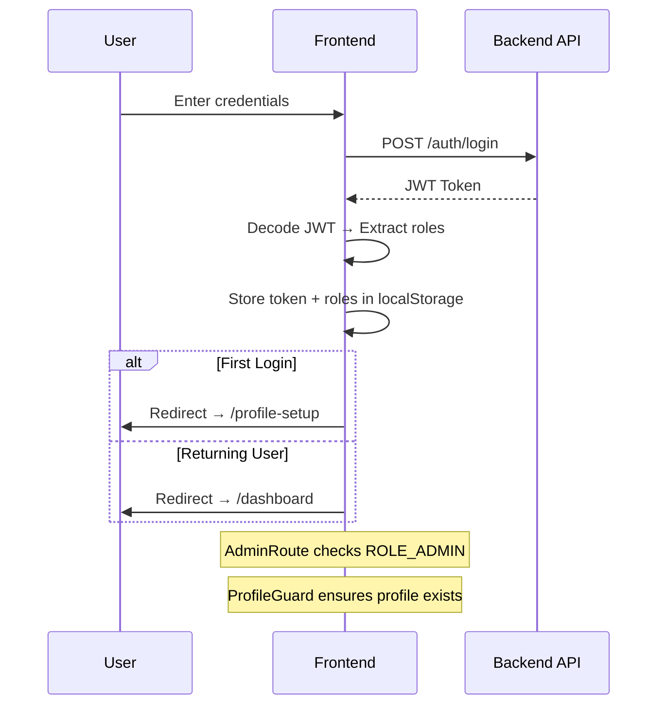

<div align="center">

# 🏠 Hostel Management System — Frontend

A modern, responsive hostel management dashboard built with **React 19** + **Vite**, featuring JWT authentication, role-based access control, and a sleek glassmorphism dark UI.

[](https://reactjs.org/)
[](https://vitejs.dev/)
[](https://jwt.io/)
[](https://reactrouter.com/)

</div>

---

## ✨ Features

- 🔐 **JWT Authentication** — Secure login/register with token-based auth & auto role extraction
- 🛡️ **Role-Based Access Control** — Separate Admin & User dashboards with protected routes
- 🏠 **Room Management** — View room details, availability, and capacity
- 🛏️ **Room Allocation** *(Admin)* — Allocate & vacate rooms for students
- 📌 **Attendance Tracking** — Students mark attendance; admins view attendance history
- 👤 **Profile Management** — Mandatory profile setup on first login + editable profiles
- 🌑 **Dark Glassmorphism UI** — Beautiful frosted-glass cards with gradient backgrounds
- ⚡ **Blazing Fast** — Powered by Vite for instant HMR and fast builds

---

## 🏗️ Architecture

```
src/
├── pages/                  # All page components
│   ├── Login.jsx           # User login
│   ├── Register.jsx        # New user registration
│   ├── Dashboard.jsx       # Main dashboard (role-aware)
│   ├── Rooms.jsx           # Room listing & details
│   ├── Attendance.jsx      # Student attendance marking
│   ├── Allocations.jsx     # 🔒 Admin: Room allocation
│   ├── AdminAttendance.jsx # 🔒 Admin: Attendance history
│   ├── ProfileSetup.jsx    # First-time profile setup
│   └── ProfileEdit.jsx     # Edit existing profile
│
├── routes/                 # Route guards
│   ├── AdminRoute.jsx      # Restricts access to ROLE_ADMIN
│   └── ProfileGuard.jsx    # Ensures profile is completed
│
├── services/               # API layer
│   ├── api.js              # Axios instance config
│   ├── authService.js      # Login, Register, Logout, Role check
│   └── profileService.js   # Profile CRUD operations
│
├── utils/
│   └── jwtHelper.js        # JWT decode & token utilities
│
├── App.jsx                 # Root component with all routes
├── App.css                 # Global styles
├── index.css               # Base styles & resets
└── main.jsx                # Entry point
```

---

## 🛠️ Tech Stack

| Layer          | Technology              |
|----------------|-------------------------|
| **Framework**  | React 19                |
| **Build Tool** | Vite 7                  |
| **Routing**    | React Router DOM 7      |
| **HTTP Client**| Axios                   |
| **Auth**       | JWT (jwt-decode)        |
| **Styling**    | CSS (Glassmorphism)     |
| **Backend**    | Spring Boot *(separate repo)* |

---

## 🔐 Authentication Flow



---

## 👤 Role-Based Access

| Page               | User ✅ | Admin ✅ |
|--------------------|---------|----------|
| Dashboard          | ✅      | ✅       |
| View Rooms         | ✅      | ✅       |
| Mark Attendance    | ✅      | ✅       |
| Edit Profile       | ✅      | ✅       |
| Room Allocation    | ❌      | ✅       |
| Admin Attendance   | ❌      | ✅       |

---

## 🚀 Getting Started

### Prerequisites

- [Node.js](https://nodejs.org/) (v18+)
- npm (comes with Node.js)
- Backend API running *(Spring Boot — separate repo)*

### Installation

```bash
# Clone the repository
git clone https://github.com/Madhan-29/HMS_Frontend.git

# Navigate to project directory
cd HMS_Frontend/hms-frontend

# Install dependencies
npm install

# Start development server
npm run dev
```

The app will open at **http://localhost:5173** 🚀

### Build for Production

```bash
npm run build
npm run preview
```

---

## 🔗 API Configuration

The frontend connects to the backend via Axios. Update the base URL in:

```
src/services/api.js
```

```js
const api = axios.create({
  baseURL: "http://localhost:8080/api",  // ← Your Spring Boot backend URL
});
```

---

## 📸 Pages Overview

| Page | Description |
|------|-------------|
| **Login** | Clean login form with JWT authentication |
| **Register** | New user registration |
| **Dashboard** | Role-aware hub with action cards for navigation |
| **Rooms** | Browse all hostel rooms with availability status |
| **Attendance** | Students mark daily attendance |
| **Allocations** | Admin panel for room allocation & vacation |
| **Admin Attendance** | Admin view of all student attendance records |
| **Profile Setup** | Mandatory first-login profile completion |
| **Profile Edit** | Update existing profile information |

---

## 📝 Available Scripts

| Command | Description |
|---------|-------------|
| `npm run dev` | Start dev server with hot reload |
| `npm run build` | Build for production |
| `npm run preview` | Preview production build |
| `npm run lint` | Run ESLint checks |

---

<div align="center">

**⭐ Star this repo if you found it helpful!**

Made with ❤️ by **Madhan M**

</div>
